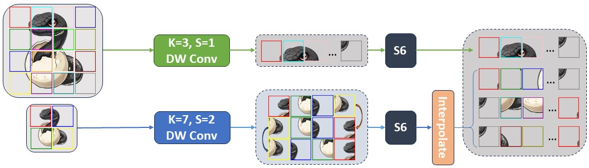

<div align="center">
<h1>MSVMamba </h1>
<h3>Multi-Scale VMamba: Hierarchy in Hierarchy Visual State Space Model</h3>

Paper: ([arXiv:2405.14174](https://arxiv.org/abs/2405.14174))
</div>

## Updates
* **` Dec. 23th, 2024`**: We release code for the updated experiments in our NeurIPS 2024 paper in the v2 branch.
* **` Sep. 26th, 2024`**: Our paper has been accepted by NeurIPS 2024 as a poster. Updated experiments will be available soon.
* **` May. 23th, 2024`**: We release the code, log and ckpt for MSVMamba


## Introduction
MSVMamba is a visual state space model that introduces a hierarchy in hierarchy design to the VMamba model. This repository contains the code for training and evaluating MSVMamba models on the ImageNet-1K dataset for image classification, COCO dataset for object detection, and ADE20K dataset for semantic segmentation.
For more information, please refer to our [paper](https://arxiv.org/abs/2405.14174).

<p align="center">
  
</p>

## Main Results

### **Classification on ImageNet-1K**

|      name      | pretrain | resolution | acc@1 | #params | FLOPs |                                               logs&ckpts                                                | 
|:--------------:| :---: | :---: |:-----:|:-------:|:-----:|:-------------------------------------------------------------------------------------------------------:| 
| MSVMamba-Nano  | ImageNet-1K | 224x224 | 77.3  |   7M    | 0.9G  |   [log&ckpt](https://drive.google.com/drive/folders/1J41w3ApitQhp2O3wHmJoOs4U032uqebK?usp=drive_link)   |
| MSVMamba-Micro | ImageNet-1K | 224x224 | 79.8  |   12M   | 1.5G  |                                              [log&ckpt](https://drive.google.com/drive/folders/1jfl2GmuKcUB8sPwRlyHK_wT0MjqgljYk?usp=drive_link)                                              | 
| MSVMamba-Tiny  | ImageNet-1K | 224x224 | 82.8  |   33M   | 4.6G  |                                              [log&ckpt](https://drive.google.com/drive/folders/1ddNWk89ohcxxMuVEaJ2Y5A6xeBKgA7lU?usp=drive_link)                                              | 

### **Object Detection on COCO**
  
|    Backbone    | #params | FLOPs | Detector | box mAP | mask mAP |     logs&ckpts     | 
|:--------------:|:-------:|:-----:| :---: |:-------:|:--------:|:------------------:|
| MSVMamba-Micro |   32M   | 201G  | MaskRCNN@1x |  43.8   |   39.9   | [log&ckpt](https://drive.google.com/drive/folders/12CrNAGBalU0yoQcQgPTGO5lM397Jc4La?usp=drive_link) |
| MSVMamba-Tiny  |   53M   | 252G  | MaskRCNN@1x |  46.9   |   42.2   | [log&ckpt](https://drive.google.com/drive/folders/1MogQ6PGdrgsyJckJTL9BJzlMCodJ3epu?usp=drive_link) |
|    MSVMamba-Micro    |   32M   | 201G  | MaskRCNN@3x |  46.3   |   41.8   | [log&ckpt](https://drive.google.com/drive/folders/10-8cDnRfnk_j4QxMHkhUyecucnM_82pt?usp=drive_link) |
|    MSVMamba-Tiny    |   53M   | 252G  | MaskRCNN@3x |  48.3   |   43.2   | [log&ckpt](https://drive.google.com/drive/folders/1dK1qFjaU8GmqvsmMr1mgppNJlNacHPtG?usp=drive_link) |


### **Semantic Segmentation on ADE20K**

|   Backbone    | Input| #params | FLOPs | Segmentor | mIoU(SS) | mIoU(MS) |                                                                                          logs&ckpts                                                                                          |
|:-------------:| :---: |:-------:|:-----:| :---: |:--------:|:--------:|:--------------------------------------------------------------------------------------------------------------------------------------------------------------------------------------------:|
|MSVMamba-Micro | 512x512 |   42M   | 875G  | UperNet@160k |   45.1   |   45.4   |                                             [log&ckpt](https://drive.google.com/drive/folders/1naZHL4mwTchllAE001SsyZ_z4y_JRF0s?usp=drive_link)                                              | 
|  MSVMamba-Tiny   | 512x512 |   65M   | 942G  | UperNet@160k |   47.8   |    -     |                                             [log&ckpt](https://drive.google.com/drive/folders/1FaFPFExDd_4goIlLjTR7fXsuMRr-vYoY?usp=drive_link)                                              | 


## Getting Started
The steps to create env, train and evaluate MSVMamba models are followed by the same steps as VMamba.

### Installation

**Step 1: Clone the MSVMamba repository:**

```bash
git clone https://github.com/YuHengsss/MSVMamba.git
cd MSVMamba
```

**Step 2: Environment Setup:**

***Create and activate a new conda environment***

```bash
conda create -n msvmamba
conda activate msvmamba
```

***Install Dependencies***

```bash
pip install -r requirements.txt
cd kernels/selective_scan && pip install .
```
<!-- cd kernels/cross_scan && pip install . -->


***Dependencies for `Detection` and `Segmentation` (optional)***

```bash
pip install mmengine==0.10.1 mmcv==2.1.0 opencv-python-headless ftfy regex
pip install mmdet==3.3.0 mmsegmentation==1.2.2 mmpretrain==1.2.0
```

<!-- conda create -n cu12 python=3.10 -y && conda activate cu12
pip install torch torchvision torchaudio --index-url https://download.pytorch.org/whl/cu121
# install cuda121 for windows
# install https://visualstudio.microsoft.com/visual-cpp-build-tools/
pip install timm==0.4.12 fvcore packaging -->


### Quick Start

**Classification**

To train MSVMamba models for classification on ImageNet, use the following commands for different configurations:

```bash
python -m torch.distributed.launch --nnodes=1 --node_rank=0 --nproc_per_node=8 --master_addr="127.0.0.1" --master_port=29501 main.py --cfg </path/to/config> --batch-size 128 --data-path </path/of/dataset> --output /tmp
```

If you only want to test the performance (together with params and flops):

```bash
python -m torch.distributed.launch --nnodes=1 --node_rank=0 --nproc_per_node=1 --master_addr="127.0.0.1" --master_port=29501 main.py --cfg </path/to/config> --batch-size 128 --data-path </path/of/dataset> --output /tmp --resume </path/of/checkpoint> --eval
```

**Detection and Segmentation**

To evaluate with `mmdetection` or `mmsegmentation`:
```bash
bash ./tools/dist_test.sh </path/to/config> </path/to/checkpoint> 1
```
*use `--tta` to get the `mIoU(ms)` in segmentation*

To train with `mmdetection` or `mmsegmentation`:
```bash
bash ./tools/dist_train.sh </path/to/config> 8
```


## Citation
If MSVMamba is helpful for your research, please cite the following paper:
```
@article{shi2024multiscale,
      title={Multi-Scale VMamba: Hierarchy in Hierarchy Visual State Space Model}, 
      author={Yuheng Shi and Minjing Dong and Chang Xu},
      journal={arXiv preprint arXiv:2405.14174},
      year={2024}
}
```

## Acknowledgment

This project is based on VMamba([paper](https://arxiv.org/abs/2401.10166), [code](https://github.com/MzeroMiko/VMamba)), Mamba ([paper](https://arxiv.org/abs/2312.00752), [code](https://github.com/state-spaces/mamba)), Swin-Transformer ([paper](https://arxiv.org/pdf/2103.14030.pdf), [code](https://github.com/microsoft/Swin-Transformer)), ConvNeXt ([paper](https://arxiv.org/abs/2201.03545), [code](https://github.com/facebookresearch/ConvNeXt)), [OpenMMLab](https://github.com/open-mmlab),
 thanks for their excellent works.

